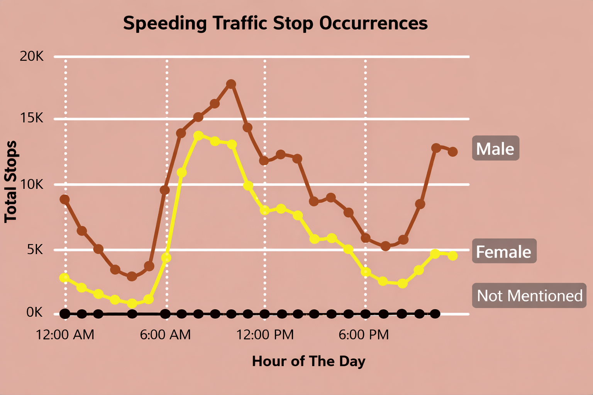

# Traffic Stop Analysis - Driver Risk & Enforcement Patterns

## Executive Summary
This analysis examines approximately more than **2 million** traffic stop records from Montgomery County, Maryland (2012–2025) to identify patterns in enforcement behavior, driver risk, and time-of-day trends. Traffic stops peak disproportionately during late night hours **(10–11 PM)** despite lower overall traffic volume, suggesting increased enforcement selectivity when fewer vehicles are on the road. Speeding is the most common reason for traffic stops across all periods, with the highest frequency occurring during morning commute hours, consistent with time-pressure commuter behavior. Differences in stop frequency across driver and vehicle characteristics largely reflect exposure effects rather than elevated individual risk. Due to the absence of traffic volume data, findings should be interpreted as stop-frequency patterns rather than normalized risk rates.

## Source
- Source: Public traffic stop records
  https://data.montgomerycountymd.gov/Public-Safety/Traffic-Violations/4mse-ku6q/about_data
- Timeframe: 2012–2025
- Records: ~2.07 million
- Scope: Montgomery county (Maryland)

## Data & Preparations

  

  

- Normalizing vehicle make values
- Parsing description to map reason for stop
- Parsing and standardizing date/time fields
- Handling null and unknown categories
- Creating derived time based features (hour of the day)

## Tools & Technologies
- Python (pandas & numpy)
- SQL (PostgreSQL)
- Power BI

## Key Questions
- When are drivers most likely to be stopped?
- Which driver and vehicle characteristics are associated with higher stop frequency?
- Which violations most commonly lead to traffic stops?
- How do enforcement patterns differ during low traffic hours?
- Are late night stops disproportionately frequent relative to traffic volume?

## Key Insights
- Traffic stops peak disproportionately during late night hours (10–11 PM), despite lower overall traffic volume.
  - This suggests higher enforcement visibility and discretion at night, where sparse traffic makes speeding, impaired driving, or erratic behavior easier to detect.
- Post-pandemic traffic stops increase earlier in the day and remain more evenly distributed across daytime and evening hours, diverging from pre-pandemic patterns that were more concentrated around traditional commute periods.

  

  
- Speeding is the most common reason for traffic stops across all time periods.
  - However, traffic stops related to speeding occur most often in the morning hours. This is higher by 77% in comparison to speeding reated incidents at 10pm.
  - This pattern is consistent with commuter behavior, where time pressure during morning rush hours increases the likelihood of speeding.

  

- Lower nighttime traffic density increases enforcement selectivity, making individual vehicles more likely to be singled out for stops compared to daytime conditions with higher traffic volume.
- Observed differences in stop frequency across driver and vehicle characteristics largely reflect exposure effects rather than elevated risk.
  - Vehicle types and driver groups that appear more frequently in stop data are also those more commonly present on the road, suggesting proportional enforcement rather than targeted disparities.

## Dashboard & Visualizations
An interactive Power BI dashboard was created to visualize:
- Hourly distribution of traffic stops
- Violation type breakdowns
- Geographic concentration of stops

The dashboard is designed to support quick exploration of enforcement patterns and time-based risk.

## Limitations & Assumptions
- The dataset is limited to a single county in Maryland and may not generalize to other regions.
- A small portion of records (<1%) contain invalid or mislocated geographic coordinates, likely due to data entry or geocoding errors.
- Around 50% of the stop reasons and 14% of car makes could not be accurately mapped.
- Traffic volume data was not directly available; conclusions are based on stop frequency patterns.
- Enforcement practices may vary over time due to policy or staffing changes.

## Recommendations
- **Evaluate late-night patrol allocation against safety outcomes:** Traffic stops peak between 10–11 PM despite lower traffic volume. Comparing enforcement intensity during these hours with crash and DUI incident data could help determine whether late-night staffing levels align with measurable safety outcomes.

- **Incorporate time-of-day context into behavioral risk models:** Late-night driving exposure may be weighted as one contextual feature in insurer or fleet risk models, alongside objective behaviors such as speeding frequency, trip duration, and driving history.

- **Improve data entry standardization to strengthen enforcement analytics:** High rates of unmapped stop reasons and vehicle makes limit interpretability. More structured and standardized input fields would enable more reliable trend analysis and policy evaluation.

## Future Improvements
- Integrate traffic volume or population data to normalize stop frequency.
- Expand the analysis to include additional counties or statewide data.
- Improve classification of stop reasons and vehicle makes to reduce unknown categories.
